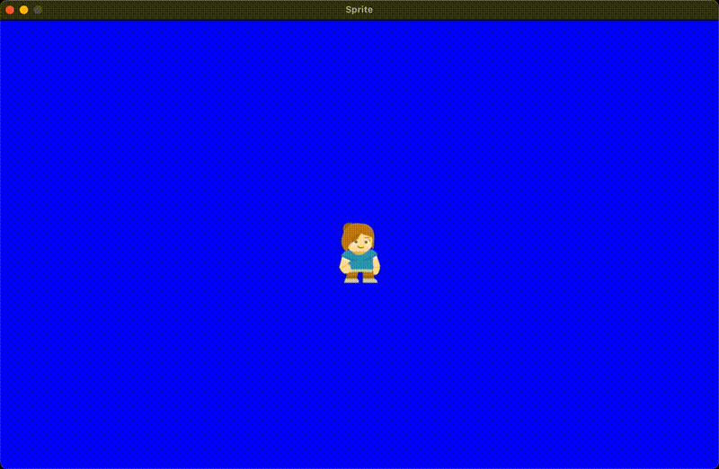

# Sprite Template

Python script for creating a sprite. It is a starter for Python game development, based on what I learned from teaching computer science for a couple years.

## Requirements

[python3 &#128279;](https://www.python.org/downloads/)

## Getting Started

Create a virtual environment: 
`python3 -m venv .venv`

Activate it: 
`source .venv/bin/activate` (macOS) 
`.venv\Scripts\activate` (Windows)

Install Pygame module: 
`pip install pygame`

Run "base.py" : 
`python base.py`

*Tinker!*